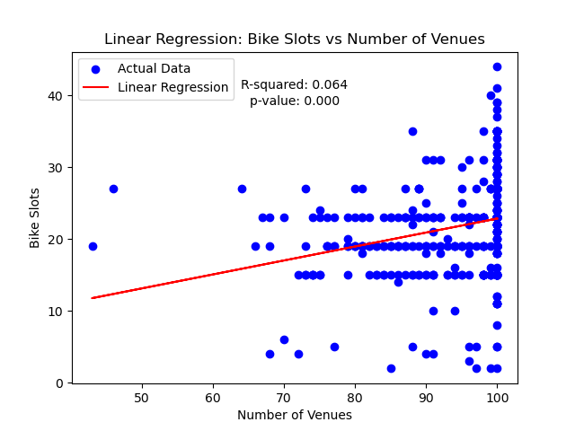

# Biking The Bay Area
By Brigitte Yan |
April 2024 

## Overview
This project parses bike-sharing data from the CityBikes API and integrates it with location-based information from Foursquare and Yelp APIs. Through data exploration, visualization, and regression modeling, we analyze the relationship between bike station attributes and nearby points of interest.

## Features
Parsing information from APIs |
Exploratory Data Analysis |
Simple linear regression model 

## Technologies Used

Python  |
Pandas |
Matplotlib |
Statsmodels |
Numpy 

## Data Sources
[Lighthouse Labs Project Repository](https://github.com/lighthouse-labs/Final-Project-Statistical-Modelling-with-Python)

[CityBikes API](https://api.citybik.es/v2/)

[Yelp API](https://docs.developer.yelp.com/reference/v3_business_search)

[Foursquare API](https://docs.foursquare.com/developer/reference/place-search)

## Parsing Information from APIs
In this section, I explore how to gather and structure data from various APIs to enrich group activities centered around bike stations. Initially, I use the CityBikes API to fetch essential station details such as names, IDs, coordinates, and bike availability. This information is then organized into a structured DataFrame, providing the basis for further analyses and integrations.

Following the CityBikes API, I establish connections with the Foursquare and Yelp APIs to extract insights on nearby venues suitable for group outings. By utilizing location coordinates and predefined categories (bars, restaurants, outdoor group activites, arts, etc...), I formulate queries to retrieve venues within a 1000-meter radius. The collected venue data, encompassing IDs, categories, locations, ratings, and reviews, is parsed into separate DataFrames for analysis and visualization.

## Joining Data from Both APIs 

During this phase, I integrate data acquired from the CityBikes API with venue details retrieved from both the Foursquare and Yelp APIs.

Following that, I consolidate the Foursquare and Yelp DataFrames into a unified dataset utilizing a function called `combine_yelp_fsq()`. This procedure entails merging the DataFrames while upholding individual entries and maintaining data coherence. To address duplicate venue listings, I conduct a thorough examination and weed out redundant entries based on predefined criteria.

Concluding the process, I conduct statistical analyses to assess the distribution of venues per bike station, gaining deeper insights into the dataset.

## Building a SQLite Database 
In this phase, I create a SQLite database to house the extensive datasets retrieved from the CityBikes, Foursquare, and Yelp APIs. Through the SQLite3 library, I establish a connection and define tables for each dataset, setting data types and constraints for efficient data handling.

After establishing the database schema, I populate the tables with data extracted from the respective APIs using customized functions tailored for each dataset. These functions parse the Pandas DataFrames from API responses and insert the data into the corresponding database tables.

To maintain data integrity and coherence, I execute various data cleaning and normalization tasks, such as removing redundant whitespace and trimming strings. Moreover, I employ SQL queries to adjust data types, modify table structures, and optimize database performance.

Finally, I validate the successful population of tables and ensure the integrity of the data stored in the SQLite database by verifying the connections between tables through foreign and primary keys.

## Exploratory Data Analysis

I assess bike station slot distribution with box plots and examine venue result counts per station, identifying outliers. Additionally, I map bike stations to observe clustering patterns, shedding light on spatial distribution. Histograms explore venue distances, revealing spatial patterns. 

## Simple Linear Regression Model

In this phase, I analyze the correlation between nearby venues and bike availability. First, I merge Foursquare and Yelp venue data with CityBikes station information. Then, I use linear regression to explore the relationship between venue count and available bike slots. The regression yields insights into how venue proximity affects bike availability, supported by stats metrics. Additionally, a scatterplot with a regression line is plotted to visually represent the relationship between these variables.

## Results
The bike stations predominantly cluster in three key areas: San Francisco, Oakland, and San Jose, with a median of 23 bike slots per station. Notably, Foursquare consistently returns fewer than 50 venues for specified bike stations compared to Yelp. Moreover, Yelp tends to yield venues closer to bike stations than Foursquare does. Interestingly, despite some venues falling outside the defined 1000m radius, both APIs consistently return results. 

In the linear regression analysis of bike slots (x) and the number of nearby venues (y), the R-squared value stands at 0.064, indicating that approximately 6.4% of the variability in bike slots can be attributed to the number of nearby venues. The regression equation is y = 0.1944x + 3.4347. Furthermore, with a p-value of 0, there is a statistically significant relationship between the number of nearby venues and bike slots, underscoring the predictive power of the `num_venues` coefficient in determining bike slots.

